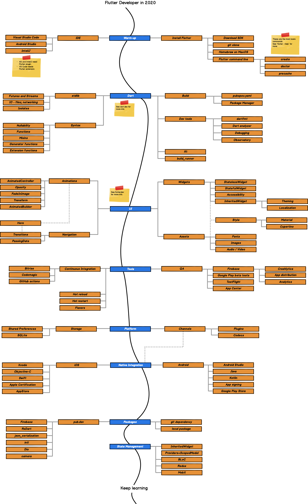

# Flutter_Learning_Path :-

  Here I am with some information related how can we become PRO in Flutter. :open_book::woman_technologist:
  
  ## Kindly follow below steps :- :pushpin:

+ What is Flutter? :- 

    - [Main Website of Flutter](https://flutter.dev/)
    
    - [What is Open Source?](https://en.wikipedia.org/wiki/Open-source_software)
    
    - [What is UI](https://en.wikipedia.org/wiki/User_interface)
    
    - [What is SDK](https://en.wikipedia.org/wiki/Software_development_kit)
    
    - [Cross Platform](https://dart.dev/platforms)
    
+ Start Flutter For  Developers :-

   - [Flutter](https://flutter.dev/)
   
   - [CodeLabs](https://codelabs.developers.google.com/?cat=Flutter)
   
+ Learn Dart :-

  - [Udemy Dart Beginner](https://www.udemy.com/course/dart-beginners-course/)
  
  - [Udemy Dart Intermediate](https://www.udemy.com/course/dart-intermediate-course/)
  
  - [Udemy Dart Expert](https://www.udemy.com/course/dart-advanced-course/)
  

+ Learn Flutter :-
  
  - [The Complete 2020 Flutter Development Bootcamp with Dart](https://www.udemy.com/course/flutter-bootcamp-with-dart/)
  
  - [Flutter & Dart - The Complete Guide](https://www.udemy.com/course/learn-flutter-dart-to-build-ios-android-apps/)
  
  - [Flutter & Firebase: Build a Complete App for iOS & Android](https://www.udemy.com/course/flutter-firebase-build-a-complete-app-for-ios-android/)
  
#### Also you can go with [Flutter Career Path - Become PRO Dev Course By Pawan Kumar - MTechViral](https://www.youtube.com/watch?v=Nl2kmAbC0bg&list=PLR2qQy0Zxs_WAho9MWS1e36xF9PKLdM5w)  
  
## Roadmap_To_Learn_Flutter :- :motorway:
  
 
